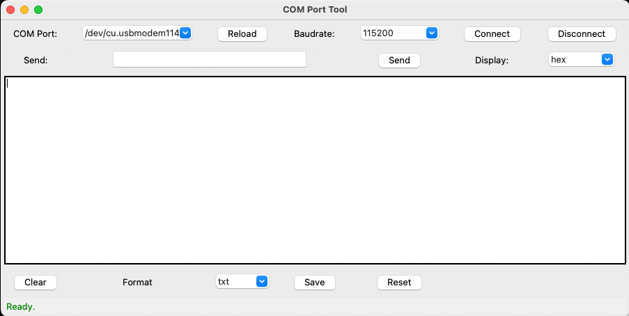
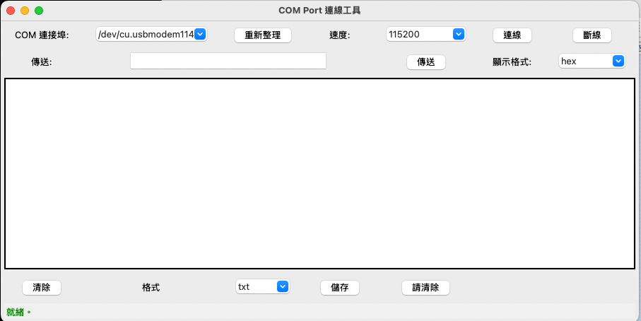

# COM Port Tool

A multilingual COM Port connection and data transmission/receiving tool, built with Python Tkinter GUI. Supports Windows/macOS/Linux.

## Features
- Automatically detects available COM ports, supports auto connect/disconnect
- Multilingual support (English, Traditional Chinese, Simplified Chinese, Spanish, Portuguese)
- Selectable baudrate
- Supports three data formats: string, hex, decimal
- Real-time data display and transmission
- Editable data display area
- Supports data saving (csv/txt/log)
- Settings auto-saved in setup.json
- Built-in tutorial/help

## Installation & Usage
1. Install Python 3.x
2. Install required packages:
   ```bash
   pip install pyserial
   ```
3. Run the main program:
   ```bash
   python 01_comport.py
   ```

## Language Switching
- Use the "Language" menu at the top of the window to switch languages instantly. The setting is auto-saved.

## Data Format Guide
- **string**: Enter text directly (e.g. `Hello123\r\n`)
- **hex**: Enter hexadecimal string (e.g. `48 65 6C 6C 6F 31 32 33 0D 0A`)
- **decimal**: Enter decimal string (e.g. `72 101 108 108 111 49 50 51 13 10`)

## Author
Powen Ko  
Website: [www.powenko.com](http://www.powenko.com)

## Screenshots



## 💡 Support This Project

If you find this project helpful, please consider supporting the author **Powen Ko**.  
Your donation helps maintain and improve open-source software, create high-quality tutorials, and contribute to the developer community.

[](https://www.paypal.com/ncp/payment/4W7NYVPYLUHBQ)

---

# COM Port Tool

多國語言的 COM Port 連線與資料傳送/接收工具，使用 Python Tkinter 製作 GUI，支援 Windows/macOS/Linux。


## 主要功能
- 自動偵測可用 COM port，支援自動連線/斷線
- 支援多國語言（英文、繁體中文、簡體中文、西班牙文、葡萄牙文）
- 可選擇 baudrate
- 支援三種資料格式：string、hex、decimal
- 可即時顯示與傳送資料
- 資料顯示區可編輯
- 支援資料儲存（csv/txt/log）
- 設定自動保存於 setup.json
- 內建教學說明

## 安裝與執行
1. 安裝 Python 3.x
2. 安裝必要套件：
   ```bash
   pip install pyserial
   ```
3. 執行主程式：
   ```bash
   python 01_comport.py
   ```

## 語言切換
- 於視窗上方選單「Language」可即時切換語言，設定會自動保存。

## 資料格式說明
- **string**：直接輸入文字（如 `Hello123\r\n`）
- **hex**：輸入十六進位字串（如 `48 65 6C 6C 6F 31 32 33 0D 0A`）
- **decimal**：輸入十進位字串（如 `72 101 108 108 111 49 50 51 13 10`）

## 作者
Powen Ko  
網站：[www.powenko.com](http://www.powenko.com)

## 螢幕截圖 


## 💡 支持這個專案

如果您覺得這個專案對您有幫助，歡迎支持作者 **Powen Ko**。  
您的捐款將協助我們持續維護與改進開源工具，創作高品質的教學內容，並推動技術社群的成長。

[](https://www.paypal.com/ncp/payment/4W7NYVPYLUHBQ)
